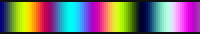

# PixelBlaze Patterns

**NOTE**: the file needed to work on a PixelBlaze for each pattern is the `*.epe` file. The `*.js` files are
only supplied to offer an easy method of reviewing the code in the pattern and will _not_ work on a 
pixelblaze (although you could copy/paste the code into a new pattern on your own PixelBlaze and that would 
also work just fine).

Other patterns and originals of edited patterns can be found at [PixelBlaze Patterns](https://electromage.com/patterns).

## 1D

- **Color Blend w/Spread**
	[Pattern Download](https://raw.githubusercontent.com/benjamw/led_controller_patterns/main/pixelblaze/1D/ColorBlend_wSpread.epe) (right click and "Save link as...")
	[Pattern code](1D/ColorBlend_wSpread.js)

    

	A pattern where there are three waves of color of red, green, and blue and they can be made to move at 
	different speeds, sizes and directions, creating a never-ending cycle of colors.

- **Controlled color bands**
	[Pattern Download](https://raw.githubusercontent.com/benjamw/led_controller_patterns/main/pixelblaze/1D/Controlled_color_bands.epe) (right click and "Save link as...")
	[Pattern code](1D/Controlled_color_bands.js)

	A modified version of `color bands` with controls added to modify the pattern on the fly.

- **Controlled color twinkle bounce**
	[Pattern Download](https://raw.githubusercontent.com/benjamw/led_controller_patterns/main/pixelblaze/1D/Controlled_color_twinkle_bounce.epe) (right click and "Save link as...")
	[Pattern code](1D/Controlled_color_twinkle_bounce.js)

	A modified version of `color twinkle bounce` with controls added to modify the pattern on the fly.
